# Dropoud

Dropoud is a modern platform built to make digital processes easier and more organized. It provides a clean, fast, and user-friendly experience that helps users complete tasks smoothly and efficiently.

I was a core contributor in the development of Dropoud (v2), where I helped build key parts of the platform and improve the overall user experience.

The platform was built with a focus on performance, clean design, scalability, and ease of use across different devices.

---

## Project Preview

### Desktop View

#### Dashboard Signup Page for Dropoud

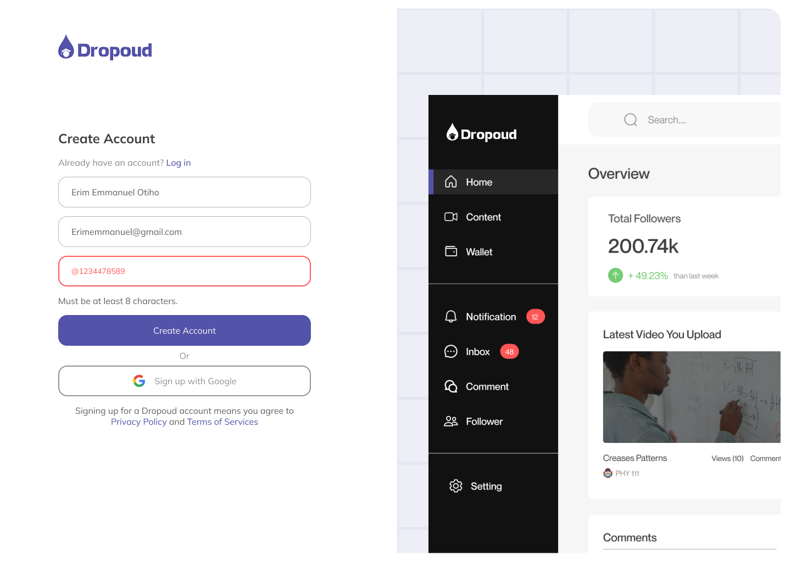

#### Dashboard Login Page for Dropoud
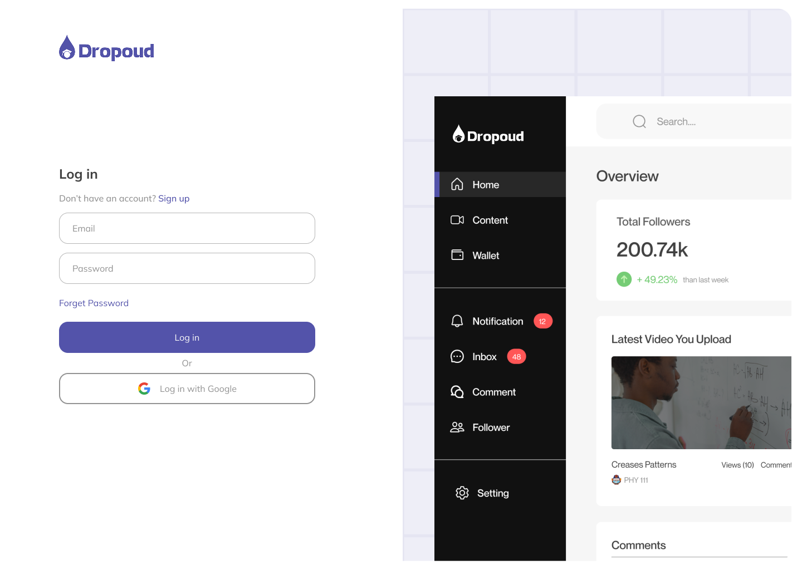
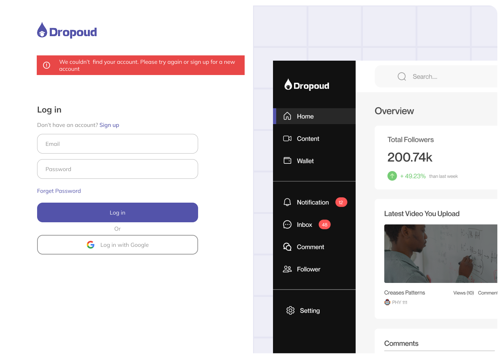


#### Dashboard Home Page
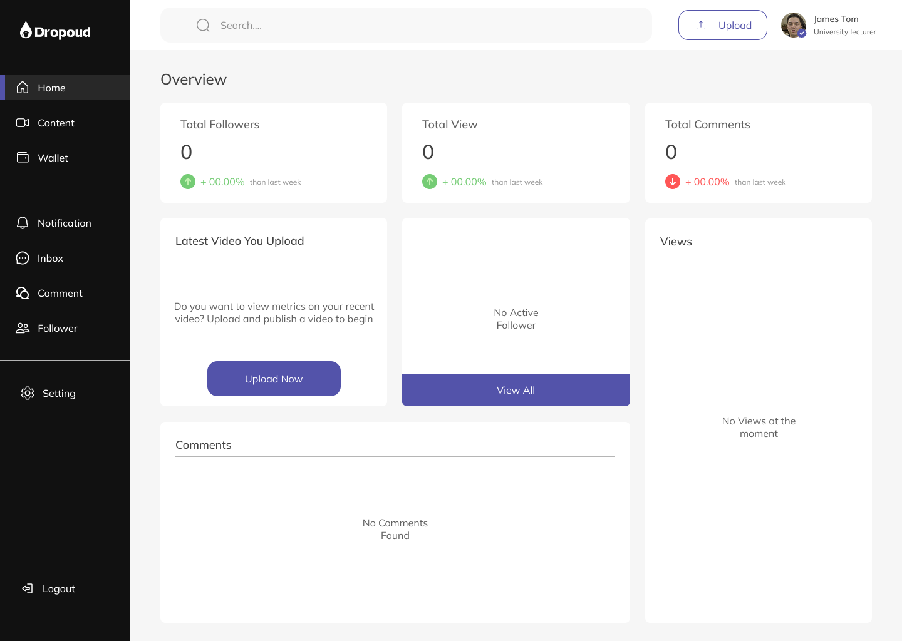 
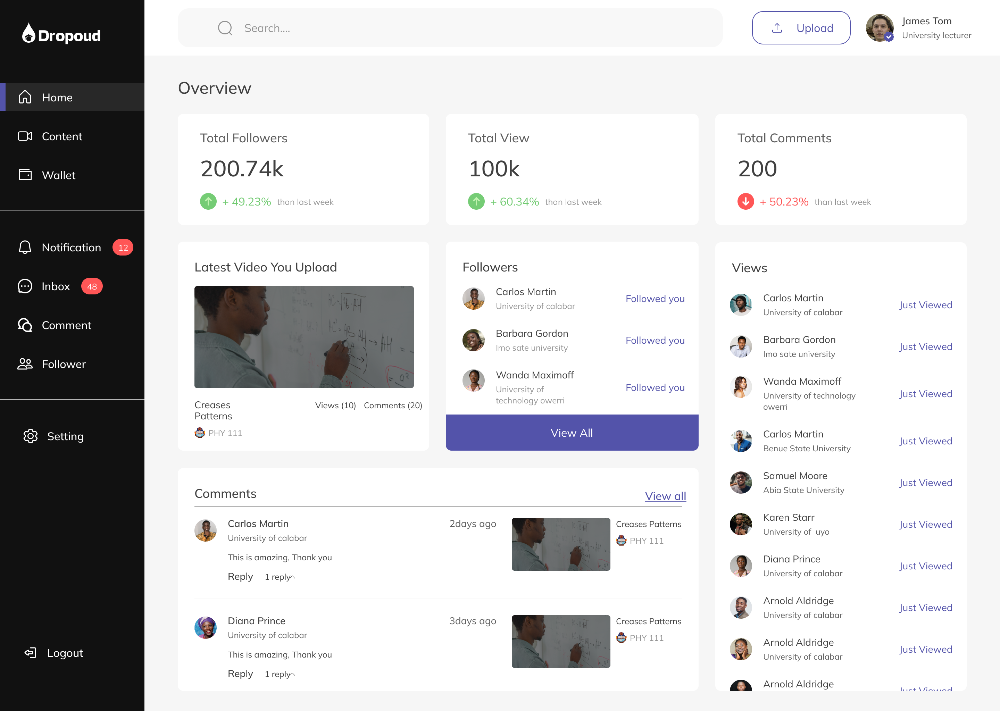

#### Dashboard Content Page
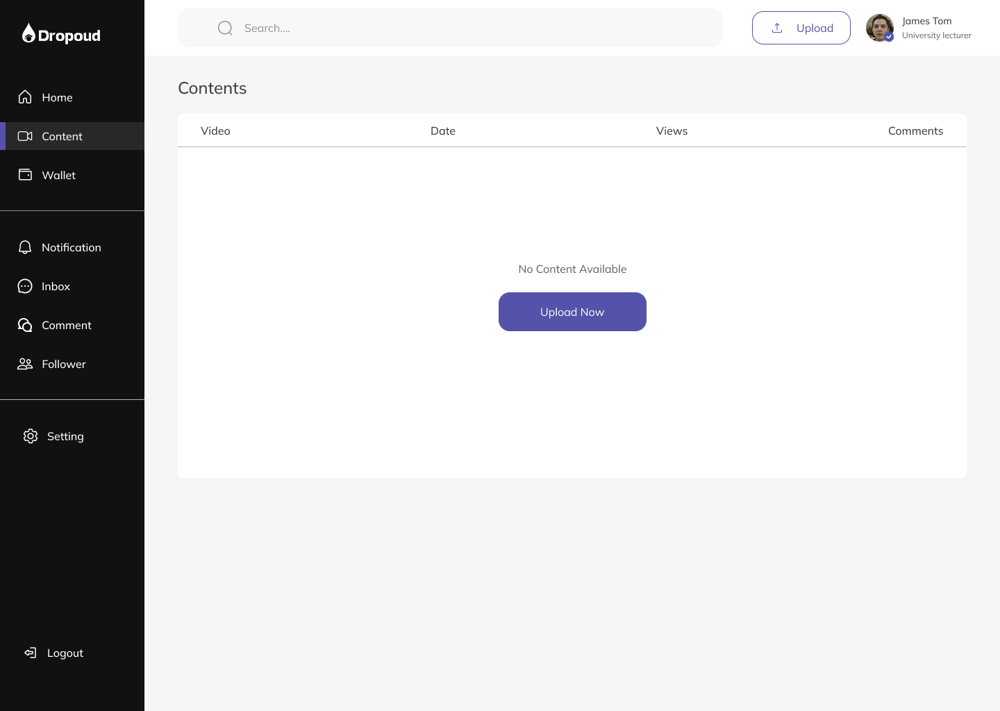
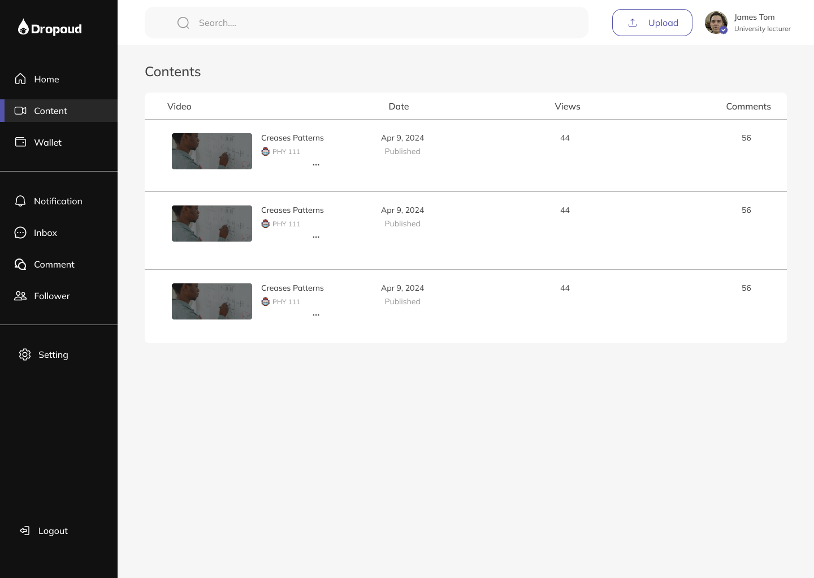

#### Dashboard Wallet Page
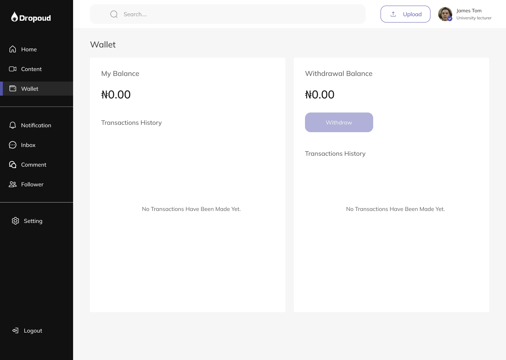
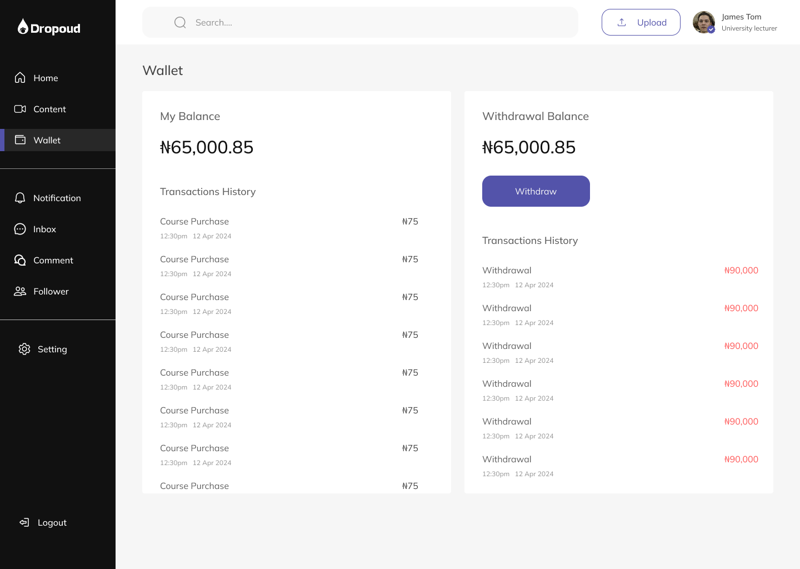


#### Dashboard Notification Page
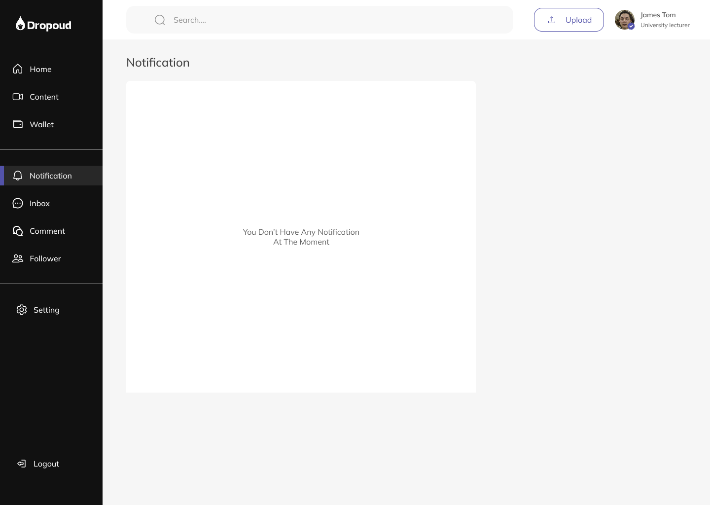
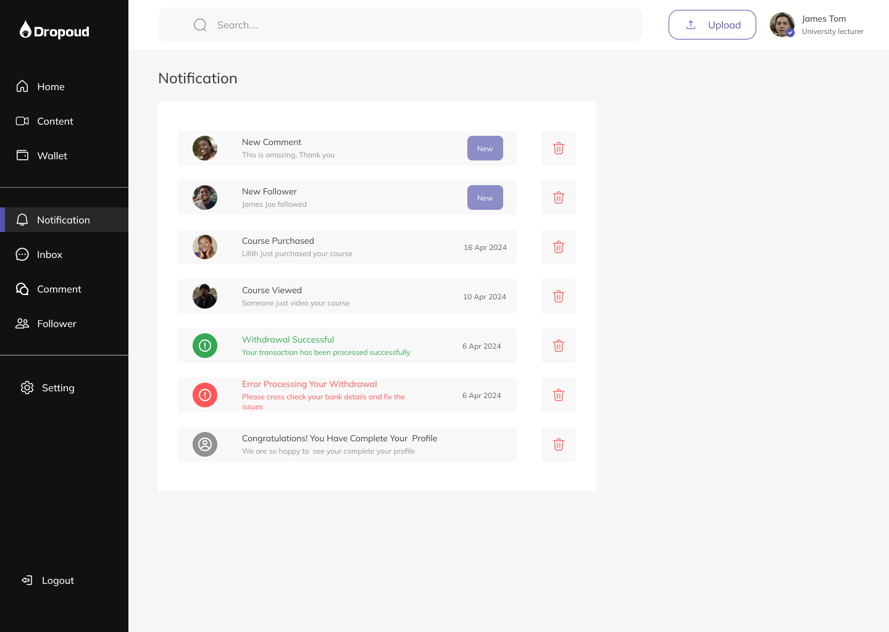

---

---

## Tech Stack Used

- Tailwind CSS
- React
- TypeScript
- Nx Monorepo
- Swagger Documentation
- ShadCN UI

---

## Key Features

- Clean and responsive user interface  
- Fast and smooth user experience  
- Reusable UI components with ShadCN UI  
- Scalable project structure using Nx Monorepo  
- API integration and documentation with Swagger  
- Styled with Tailwind CSS for responsiveness


## Getting Started

1. Clone the Repository

```bash
git clone https://github.com/aniekan7132/dropoud.git
```

### Navigate into the Project Directory

```bash
cd dropoud-main
```

### Install Dependencies

```bash
npm install
```

### Run Development Server

```bash
npm run dev
```

Open your browser and visit:
note: you port "3000" might be different.

```plaintext
http://localhost:3000
```

## Production Build

To create a production-ready build:

```bash
npm run build
npm start
```

## Project Structure

This project is built with React.js and follows a component-based architecture for better code organization and reusability.

The application is structured into reusable components, pages, and shared utilities to make development easier and improve maintainability.

## Deployment

The application is production-ready and can be deployed on any server that supports Node.js environments.


This template provides a minimal setup to get React working in Vite with HMR and some ESLint rules.

Currently, two official plugins are available:

- [@vitejs/plugin-react](https://github.com/vitejs/vite-plugin-react/blob/main/packages/plugin-react/README.md) uses [Babel](https://babeljs.io/) for Fast Refresh
- [@vitejs/plugin-react-swc](https://github.com/vitejs/vite-plugin-react-swc) uses [SWC](https://swc.rs/) for Fast Refresh

## Expanding the ESLint configuration

If you are developing a production application, we recommend updating the configuration to enable type aware lint rules:

- Configure the top-level `parserOptions` property like this:

```js
export default {
  // other rules...
  parserOptions: {
    ecmaVersion: 'latest',
    sourceType: 'module',
    project: ['./tsconfig.json', './tsconfig.node.json'],
    tsconfigRootDir: __dirname,
  },
}
```

- Replace `plugin:@typescript-eslint/recommended` to `plugin:@typescript-eslint/recommended-type-checked` or `plugin:@typescript-eslint/strict-type-checked`
- Optionally add `plugin:@typescript-eslint/stylistic-type-checked`
- Install [eslint-plugin-react](https://github.com/jsx-eslint/eslint-plugin-react) and add `plugin:react/recommended` & `plugin:react/jsx-runtime` to the `extends` list


